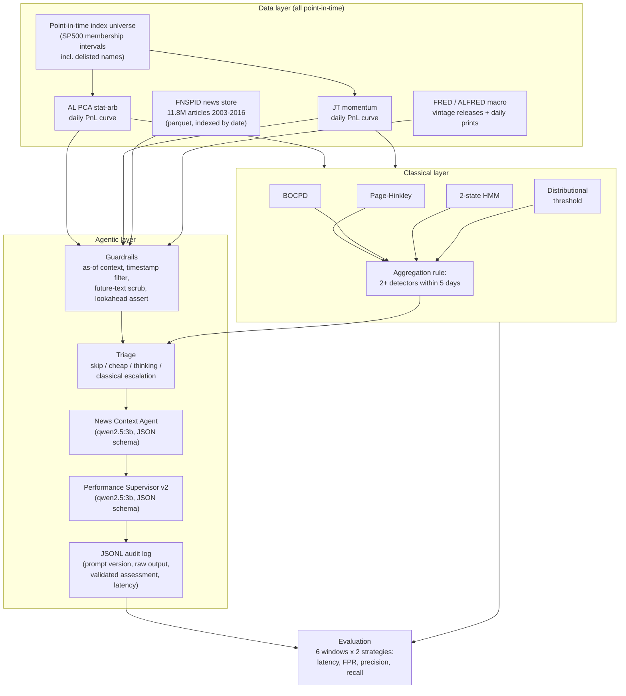
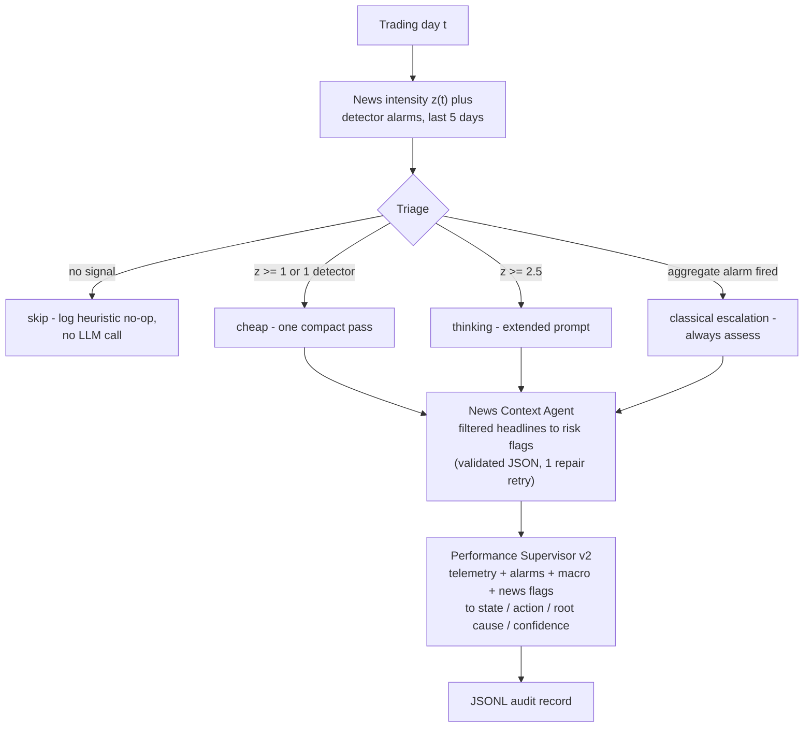

# System Overview

This document describes the architecture of the in-market monitoring system:
a **classical layer** (statistical change-point detectors) and an **agentic
layer** (LLM agents fed by news and macro context), built to test whether
agentic monitoring detects strategy regime breaks *faster* and with *fewer
false positives* than classical methods (hypothesis H1), and whether that
advantage generalises across strategies (H2) or differs by strategy (H3).

Both layers observe the same two trading strategies and are evaluated on the
same six historical windows under strict information parity: **neither layer
may see anything that was not knowable on the decision date.**

# Data Layer: the Point-in-Time Substrate

Everything rests on survivorship-bias-free inputs. This is the methodological
spine of the project — the headline event (the August 2007 quant meltdown) is
**invisible** on a survivor-only universe (+3.4% in the window) and only
appears on the honest universe (−4.8%, worst day −4.7%).

| Input | Construction | Point-in-time guarantee |
|---|---|---|
| Strategy universes | S&P 500 membership intervals incl. delisted names | At each rebalance, only that date's actual members are candidates |
| AL PCA daily PnL | Sector-sleeve PCA mean-reversion on PIT sleeves | Sleeves masked to membership intervals |
| JT momentum daily PnL | Cross-sectional momentum, daily curve | PIT candidate pool (~347/month vs ~542 biased) |
| News (FNSPID) | 22 GB CSV streamed to per-year parquet | Publication timestamp filtered to decision date |
| Macro (FRED/ALFRED) | Vintage history for revised series | Value used = value *published* by decision date |

The two strategies are statistically independent (daily correlation ≈ 0.003)
and break on *different* events — AL PCA on the 2007 quant meltdown, JT on the
2009 momentum crash — which is what makes the cross-strategy hypotheses (H2,
H3) testable.

# Classical Layer

Four online, causal change-point detectors, implemented from scratch for
transparency, run **continuously** over each full daily curve (real warm-up
history; no cold starts at window edges):

1. **Page-Hinkley** — two-sided mean-shift test, volatility-normalised
   (Welford) so thresholds are in sigma units and transfer across strategies.
2. **BOCPD** — Bayesian online change-point detection (Adams & MacKay);
   alarms when the MAP run-length collapses.
3. **2-state Gaussian HMM** — Baum-Welch fit with a causal forward filter;
   the higher-variance state is "stressed".
4. **Distributional threshold** — recent-vs-baseline z-score plus a
   scale-free volatility ratio.

Individual alarms combine through one fixed rule: **an aggregated alarm fires
when at least two distinct detectors alarm within five days.** All thresholds
were fixed a priori — never tuned on the six evaluation windows — so the
classical baseline is not artificially strong or weak.

# Agentic Layer

The agentic layer wraps two LLM agents in deterministic Python that controls
*what the model may see*, *when it is worth calling*, and *how its output is
audited*. The LLM is a locally served **qwen2.5:3b** (Ollama, CPU, JSON mode,
temperature 0); a deterministic rule-based stub stands in for CI so the whole
pipeline tests offline. The model is swappable behind a one-flag interface.

## Guardrails (information parity)

Every piece of context passes four independent guards, all fail-closed:

- **As-of context** — telemetry built only from returns dated on or before
  the decision date; only detector alarms that had already fired.
- **Timestamp filter** — news published after the decision date is dropped.
- **Future-text scrub** — an article published *on time* whose text mentions
  a later date (e.g. "Fed meets on 2007-09-18") is dropped entirely.
- **Lookahead assertion** — the fully assembled context is re-scanned every
  day; any future-dated leak raises an error. If the news agent's own
  narrative hallucinates a future date, its output is discarded rather than
  passed to the supervisor.

Macro data uses **ALFRED vintages** for revised series: on 2007-08-09 the
agent sees the July unemployment *first print* (4.6, published August 3),
never the later revision (4.7). Unrevised daily series (VIX, Treasury yields,
fed funds, TED spread) use the last print on or before the decision date.

## Three-stage news pipeline (before any LLM call)

Most trading days carry no information, and CPU inference costs ~100 s per
call — so the pipeline spends model calls only where the data warrants it:

1. **Risk filter** — a transparent 23-pattern regex lexicon of market-stress
   language (margin call, liquidation, quant fund stress, ...).
   Recall-oriented; precision comes later.
2. **Daily signals** — per-day article counts and a risk-intensity score,
   converted to a *causal* z-score against a trailing 60-day baseline
   shifted one day (day *t* never baselines on itself).
3. **Triage** — fixed a-priori thresholds pick the day's spend.

## Two agents, structured output only

- **News Context Agent** reads the filtered headlines for the day and must
  return a schema-validated object: `overall_risk` (LOW / ELEVATED / HIGH /
  SEVERE), flag-and-evidence pairs, a short narrative, and confidence.
- **Performance Supervisor v2** receives strategy telemetry, classical
  detector alarms, the macro block, and the news agent's summary, and returns
  the operational assessment: `state` (NORMAL / WATCH / ALERT / CRITICAL),
  `action` (HOLD / INVESTIGATE / REDUCE / HALT), a root-cause sentence,
  confidence, and which detectors it cited.

Both outputs are validated against JSON schemas with exactly one repair retry
(the model sees its own validation error once, then the run hard-fails).
Prompts are version-tagged (`news-context-v1`, `supervisor-v2`) so prompt
iteration is trackable, and every invocation is logged to a replayable JSONL
audit file with prompt version, raw output, validated result, and latency.

# Evaluation Design

Six labelled windows, identical for both layers:

| Window | Kind | Event |
|---|---|---|
| Jul–Sep 2007 | event | Quant meltdown (breaks AL PCA) |
| Aug–Nov 2008 | event | GFC / Lehman |
| Feb–May 2009 | event | Momentum crash (breaks JT) |
| Jul–Oct 2011 | event | US downgrade |
| 2004–2006 | calm | False-positive control |
| 2013–2014 | calm | False-positive control |

A true positive is an alarm (or an agent escalating to ALERT/CRITICAL) within
21 days after the labelled onset; alarms in calm windows feed the
false-positive rate. Both layers are scored with the same metrics — detection
latency, false-positive rate per day, precision, recall — which is what makes
the H1 comparison clean: same data, same windows, same scoring, and
information parity enforced by construction.

# Repository Map

| Path | Contents |
|---|---|
| `monitoring/detectors/` | The four classical detectors + aggregation rule |
| `monitoring/windows.py` | The six labelled evaluation windows |
| `monitoring/metrics.py` | Latency / FPR / precision / recall scoring |
| `monitoring/run_classical.py` | Classical end-to-end (both strategies, all windows) |
| `monitoring/news/` | FNSPID store, risk filter, daily signals, triage |
| `monitoring/macro/` | FRED/ALFRED fetch and point-in-time as-of queries |
| `monitoring/agentic/` | Schemas, prompts, guardrails, model clients, runners |
| `monitoring/run_agentic.py` | Agentic end-to-end daily loop on one window |
| `XSectional/` | JT momentum strategy + PIT universe |
| `Stat Arb/statsArb-dev/` | AL PCA strategy + PIT sleeves |
